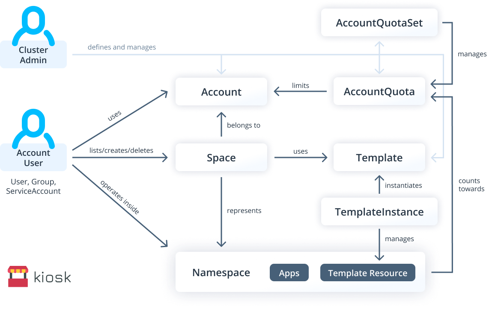
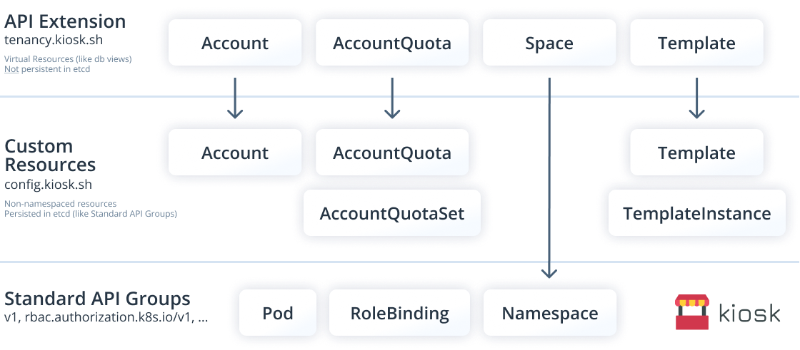

<h1></h1>

### **[Getting Started](#getting-started)** • **[Architecture](#architecture)** • **[Contributing](#contributing)** • **[Roadmap](#roadmap)**


## Multi-Tenancy Extension For Kubernetes
- **Accounts & Account Users** to separate tenants in a shared Kubernetes cluster
- **Self-Service Namespace Provisioning** for account users
- **Account Limits** to ensure quality of service and fairness when sharing a cluster
- **Namespace Templates** for secure tenant isolation and self-service namespace initialization
- **Multi-Cluster Tenant Management** for sharing a pool of clusters ([coming soon](#roadmap))

<br>


<br>

## [Community Call](https://docs.google.com/document/d/1RfT7aGKe_KOk2GyrXXnEBKF-1aXudHvajcgEntz-zFI/edit?usp=sharing)
kiosk community calls are Zoom calls that are open for anyone to join. Feel free to invite colleagues or friends who may be interested. The goal of these calls is to:

- Answer questions about kiosk and offer help for new users
- Offer a channel for project feedback and learn about use cases for kiosk
- Provide updates on new features and improvements
- Discuss feature requests and the roadmap for kiosk

☎️ [**Follow this link to join the call or to view/edit the agenda.**](https://docs.google.com/document/d/1RfT7aGKe_KOk2GyrXXnEBKF-1aXudHvajcgEntz-zFI/edit?usp=sharing)


<br>

## Contents
- [Why kiosk?](#why-kiosk)
- [Architecture](#architecture)
  - [Workflow & Interactions](#workflow--interactions)
  - [Custom Resources & Resource Groups](#custom-resources--resource-groups)
- [Getting Started](#getting-started)
  - [0. Requirements](#0-requirements)
  - [1. Install kiosk](#1-install-kiosk)
  - [2. Configure Accounts](#2-configure-accounts)
  - [3. Working with Spaces](#3-working-with-spaces)
  - [4. Setting Account limits](#4-setting-account-limits)
  - [5. Working with Templates](#5-working-with-templates)
- [Upgrade kiosk](#upgrade-kiosk)
- [Uninstall kiosk](#uninstall-kiosk)
- [Extra: User Management & Authentication](#extra-user-management--authentication)
- [Roadmap](#roadmap)
- [Contributing](#contributing)

<br>

## Why kiosk?
Kubernetes is designed as a single-tenant platform, which makes it hard for cluster admins to host multiple tenants in a single Kubernetes cluster. However, sharing a cluster has many advantages, e.g. more efficient resource utilization, less admin/configuration effort or easier sharing of cluster-internal resources among different tenants.

While there are hundreds of ways of setting up multi-tenant Kubernetes clusters and many Kubernetes distributions provide their own tenancy logic, there is no lightweight, pluggable and customizable solution that allows admins to easily add multi-tenancy capabilities to any standard Kubernetes cluster. 

### The Missing Multi-Tenancy Extension for Kubernetes [](https://twitter.com/intent/tweet?text=The%20Missing%20Multi-Tenancy%20Extension%20for%20%23Kubernetes%3A%20%23kiosk%20-%20https%3A//github.com/kiosk-sh/kiosk%20%23cncf)
kiosk is designed to be:
- **100% Open-Source**: CNCF compatible Apache 2.0 license
- **Pluggable**: easy to install into any existing cluster and suitable for different use cases
- **Fast:** emphasizing automation and self-service for tenants
- **Secure:** offering default configurations for different levels of tenant isolation
- **Extensible:** providing building blocks for higher-level Kubernetes platforms


<br>

## Architecture
The core idea of kiosk is to use Kubernetes namespaces as isolated workspaces where tenant applications can run isolated from each other. To minimize admin overhead, cluster admins are supposed to configure kiosk which then becomes a self-service system for provisioning Kubernetes namespaces for tenants.

---

### Workflow &amp; Interactions
The following diagram shows the main actors (Cluster Admins and Account Users) as well as the most relevant Kubernetes resources and their relationships.



Click on the following links to view the description for each of the actors and kiosk components:

<details>
<summary><b>Cluster Admin</b></summary>
<br>

Cluster Admins have the permission to perform CRUD operations for cluster-wide / non-namespaced resources (especially RBAC related resources as well as the custom resources Account, AccountQuota, AccountQuotaSet, and Template). Cluster Admins configure kiosk by creating and managing Accounts, AccountQuotas, AccountQuotaSets, and Templates. They can also see and configure all Spaces owned by all Accounts.

<br>
</details>

<details>
<summary><b>Account</b></summary>
<br>

Every tenant is represented by an Account. Cluster Admins define and manage Accounts and assign Account Users (Users, Groups, ServiceAccounts) to Accounts - similar to assigning RBAC Roles to subjects as part of a RoleBinding configuration. 

<br>
</details>

<details>
<summary><b>Account User</b></summary>
<br>

Account Users perform actions within the Kubernetes cluster via API server requests while using a certain Account. Cluster Admins can assign the same Account User to multiple Accounts. Account Users have access to Spaces that belong to the Accounts they are using. If assigned the default kiosk ClusterRole, every Account User has the permission to list/get/create/delete Spaces for the respective Account, however, this can be changed via RBAC RoleBindings. 

<br>
</details>

<details>
<summary><b>Space</b></summary>
<br>

A Space is a non-persistent, virtual resource that represents exactly one Kubernetes namespace. Spaces have the following characteristics:
- Every space can belong up to one Account which is the owner of this Space. Ownerless Spaces are possible.
- If a user has rights to access the underlying Namespace, the user can access the Space in the same way. Hence besides Account Users, other actors (User, Group, ServiceAccount) can also access the Space if someone grants this access via additional Kubernetes RBAC.
- Every User only sees the Spaces the User has access to. This is in contrast to regular namespaces, where Users can only list all namespaces or none
- Space ownership can be changed, by changing the ownership annotation on the namespace
- During Space creation (or Space ownership changes) a RoleBinding for the owning Account is created in the corresponding Space namespace. The referenced RBAC ClusterRole can be configured in the account
- A Space can be prepopulated during creation with a predefined set of resources by configuring default Templates in the Account. Kiosk will make sure that these resources will be correctly deployed **before** the user gets access to the namespace.

<br>
</details>

<details>
<summary><b>Namespace</b></summary>
<br>

A Namespace is a regular Kubernetes Namespace that can be accessed by anyone who has the appropriate RBAC rules to do so. Namespaces are provisioned and managed by kiosk and have a 1-to-1 relationship to the resource Space which is a custom resource of kiosk. By default, Account Users have the permission to operate within all Namespaces that are represented by Spaces which belong to one of their Accounts.

<br>
</details>

<details>
<summary><b>Template</b></summary>
<br>

Templates are defined and managed by Cluster Admins. Templates are used to initialize Spaces/Namespaces with a set of Kubernetes resources (defined as manifests or as part of a Helm chart). Templates can be created using a different ClusterRole than the Account User uses, so they can be used to create resources that are not allowed to be created by actors of the Space/Namespace, e.g. to set up certain isolation resources (e.g. Network Policies, Pod Security Policies etc.). Cluster Admins can define default Templates within the Account configuration which automatically applies these templates to each Space that is created using the respective Account. Additionally, Account Users can state other non-mandatory Templates that should also be applied when creating a Space.

<br>
</details>

<details>
<summary><b>TemplateInstance</b></summary>
<br>

When a Template is applied to a Space, kiosk creates a TemplateInstance to keep track of which Templates have been applied to the Space. A TemplateInstance contains information about the Template as well as about the parameters used to instantiate it. Additionally, TemplateInstances can be configured to sync with Templates, i.e. the TemplateInstance will update the resources whenever the Template changes that has been used to create these resources.

<br>
</details>

<details>
<summary><b>AccountQuota</b></summary>
<br>

AccountQuotas are defined and managed by Cluster Admins. AccountQuotas define cluster-wide aggregated limits for Accounts. The resources of all Spaces/Namespaces that belong to an Account count towards the aggregated limits defined in the AccountQuota. Similar to Namespaces which can be limited by multiple ResourceQuotas, an Account can be limited by multiple AccountQuotas. If the same limit (e.g. total CPU per Account) is defined by multiple AccountQuotas, the Account will be limited according to the lowest value.

<br>
</details>

<details>
<summary><b>AccountQuotaSet</b></summary>
<br>

An AccountQuotaSet defines a set of AccountQuotas which are managed by the AccountQuotaSet. It is comparable to a StatefulSet which creates and manages Pods in a Kubernetes namespace. An AccountQuotaSet consists of an accountLabelSelector and a template for an AccountQuota. For each Account that is selected by the AccountQuota, the AccountQuotaSet creates a new AccountQuota for the selected Account.

<br>
</details>

---

### Custom Resources &amp; Resource Groups
When installing kiosk in a Kubernetes cluster, these components will be added to the cluster:
- CRDs for Account, AccountQuota, AccountQuotaSet, Template, TemplateInstance
- Controller for kiosk Custom Resources (runs inside the cluster)
- API Server Extension (runs inside the cluster similar to the Controller)



kiosk adds two groups of resources to extend the Standard API Groups of Kubernetes:
1. **Custom Resources: config.kiosk.sh**  
   Custom Resource Definitions (CRDs) for configuring kiosk. These resources are persisted in etcd just like any other Kubernetes resources and are managed by an operator which runs inside the cluster.
   <details>
    <summary><b>Show List of Custom Resources</b></summary>
    <br>

      - config.kiosk.sh/Account
      - config.kiosk.sh/AccountQuota
      - config.kiosk.sh/AccountQuotaSet (soon)
      - config.kiosk.sh/Template
      - config.kiosk.sh/TemplateInstance

    <br>
    </details>
2. **API Extension: tenancy.kiosk.sh**  
   Virtual resources which are accessible via an API Server Extension and will not be persisted in etcd. These resources are similar to views in a relational database. The benefit of providing these resources instead of only using CRDs is that we can calculate access permissions dynamically for every request. That means that it does not only allow to list, edit and manage Spaces (which map 1-to-1 to Namespaces), it also allows to show a different set of Spaces for different Account Users depending on the Accounts they are associated with or in other words: this circumvents the current limitation of Kubernetes to show filtered lists of cluster-scoped resources based on access rights.
   <details>
    <summary><b>Show List of API Extension Resources</b></summary>
    <br>

      - tenancy.kiosk.sh/Account
      - tenancy.kiosk.sh/AccountQuota
      - tenancy.kiosk.sh/Space
      - tenancy.kiosk.sh/TemplateInstance

    <br>
    </details>

<br>

## Getting Started

### 0. Requirements

#### 0.1. CLI Tools
- `kubectl`: Follow [this guide](https://kubernetes.io/docs/tasks/tools/install-kubectl/) to install it.
- `helm` **version 3**: Follow [this guide](https://helm.sh/docs/intro/install/) to install it.

---

#### 0.2. Kubernetes Cluster
**kiosk supports Kubernetes version: v1.14 and higher.** Use `kubectl version` to determine the `Server Version` of your cluster. While this getting started guide should work with most Kubernetes clusters out-of-the-box, there are certain things to consider for the following types of clusters:

<details>
<summary><b>Docker Desktop Kubernetes</b></summary>
<br>

All ServiceAccounts have cluster-admin role by default, which means that emulating users with ServiceAccounts is not a good idea. Use [impersonation](#2-configure-accounts) instead.

<br>
</details>

<details>
<summary><b>Digital Ocean Kubernetes (DOKS)</b></summary>
<br>

All users in DOKS have cluster-admin role by default which means that when using impersonation, every user will have admin access. To see kiosk-based multi-tenancy in action, [create ServiceAccounts to emulate different users](#using-serviceaccounts-for-authentication).

<br>
</details>

<details>
<summary><b>Google Kubernetes Engine (GKE)</b></summary>
<br>

Your kube-context will by default **not** have cluster-admin role. Run the following command to get your google email address and to make your user cluster admin:
```bash
# GKE: make yourself admin
GKE_USER=$(gcloud config get-value account)
kubectl create clusterrolebinding cluster-admin-binding --clusterrole cluster-admin --user $GKE_USER
```

<br>
</details>

---

#### 0.3. Admin Context
You need a kube-context with admin rights. 

If running all the following commands returns `yes`, you are most likely admin:
```bash
kubectl auth can-i "*" "*" --all-namespaces
kubectl auth can-i "*" namespace
kubectl auth can-i "*" clusterrole
kubectl auth can-i "*" crd
```

<br>

### 1. Install kiosk
```bash
# Install kiosk with helm v3
kubectl create namespace kiosk
helm install kiosk --repo https://charts.devspace.sh/ kiosk --namespace kiosk --atomic
```
To verify the installation make sure the kiosk pod is running:
```bash
$ kubectl get pod -n kiosk

NAME                     READY   STATUS    RESTARTS   AGE
kiosk-58887d6cf6-nm4qc   2/2     Running   0          1h
```

<br>

### 2. Configure Accounts
In the following steps, we will use [Kubernetes user impersonation](https://kubernetes.io/docs/reference/access-authn-authz/authentication/#user-impersonation) to allow you to quickly switch between cluster admin and simple account user roles. If you are cluster admin and you want to run a `kubectl` command as a different user, you can impersonate this user by adding the `kubectl` flags `--as=[USER]` and/or `--as-group=[GROUP]`.

In this getting started guide, we assume two user roles:
- **Cluster Admin**: use your admin-context as current context (`kubectl` commands **without** `--as` flag)
- **Account User `john`**: use your admin-context to impersonate a user (`kubectl` commands **with** `--as=john`)

If you are using **Digital Ocean Kubernetes (DOKS)**, [follow this guide to simulate a user using a Service Account](#using-serviceaccounts-for-authentication).  

---

#### 2.1. Create Account
To allow a user to create and manage namespaces, they need a kiosk account. Run the following command to create such an account for our example user `john`:
```bash
# Run this as cluster admin:
kubectl apply -f https://raw.githubusercontent.com/kiosk-sh/kiosk/master/examples/account.yaml

# Alternative: ServiceAccount as Account User (see explanation for account-sa.yaml below)
# kubectl apply -f https://raw.githubusercontent.com/kiosk-sh/kiosk/master/examples/account-sa.yaml
```
<details>
<summary><b>View: account.yaml</b></summary>
<br>

```yaml
apiVersion: tenancy.kiosk.sh/v1alpha1
kind: Account
metadata:
  name: johns-account
spec:
  subjects:
  - kind: User
    name: john
    apiGroup: rbac.authorization.k8s.io
```

As you can see in this example, every account defines `subjects` which are able to use this account. In this example, there is only one subject which is a `User` with name `john`. However, Accounts can also have multiple subjects.

Subjects for kiosk Accounts are defined in the exact same way as subjects in RoleBindings. Subjects can be a combination of:
- Users
- Groups
- ServiceAccounts (see example below: `account-sa.yaml`)

<br>

</details>

<details>
<summary><b>View: account-sa.yaml (alternative for ServiceAccounts, e.g. Digital Ocean Kubernetes)</b></summary>
<br>

If you want to assign an Account to a ServiceAccount (e.g. when using Digital Ocean Kubernetes / DOKS), please use the following alternative:
```bash
# Run this as cluster admin:
kubectl apply -f https://raw.githubusercontent.com/kiosk-sh/kiosk/master/examples/account-sa.yaml
```
```yaml
apiVersion: tenancy.kiosk.sh/v1alpha1
kind: Account
metadata:
  name: johns-account
spec:
  subjects:
  - kind: ServiceAccount
    name: john
    namespace: kiosk
```

</details>

<br>

[Learn more about User Management and Accounts in kiosk.](#extra-user-management--authentication)

---

#### 2.2. View Accounts
All Account Users are able to view their Account through their generated ClusterRole. Let's try this by impersonating `john`:
```bash
# View your own accounts as regular account user
kubectl get accounts --as=john

# View the details of one of your accounts as regular account user
kubectl get account johns-account -o yaml --as=john
```

<br>

### 3. Working with Spaces
Spaces are the virtual representation of namespaces. Each Space represents exactly one namespace. The reason why we use Spaces is that by introducing this virtual resource, we can allow users to only operate on a subset of namespaces they have access to and hide other namespaces they shouldn't see. 

---

#### 3.1. Allow Users To Create Spaces
By default, Account Users **cannot** create Spaces themselves. They can only use the Spaces/Namespaces that belong to their Accounts. That means a cluster admin would need to create the Spaces for an Account and then the Account Users could work with these Spaces/Namespaces.

To allow all Account Users to create Spaces for their own Accounts, create the following RBAC ClusterRoleBinding:
```bash
# Run this as cluster admin:
kubectl apply -f https://raw.githubusercontent.com/kiosk-sh/kiosk/master/examples/rbac-creator.yaml
```

<details>
<summary><b>View: rbac-creator.yaml</b></summary>
<br>

```yaml
apiVersion: rbac.authorization.k8s.io/v1
kind: ClusterRoleBinding
metadata:
  name: kiosk-creator
subjects:
- kind: Group
  name: system:authenticated
  apiGroup: rbac.authorization.k8s.io
roleRef:
  kind: ClusterRole
  name: kiosk-edit
  apiGroup: rbac.authorization.k8s.io
```

> Of course, you can also adjust this ClusterRoleBinding in a way that only certain subjects/users can create Spaces for their Accounts. Just modify the `subjects` section.

<br>
</details>

---

#### 3.2. Create Spaces
After granting Account Users the right to create Spaces for their Accounts (see ClusterRoleBinding in 3.1.), all Account Users are able to create Spaces. Let's try this by impersonating `john`:
```bash
kubectl apply -f https://raw.githubusercontent.com/kiosk-sh/kiosk/master/examples/space.yaml --as=john
```
<details>
<summary><b>View: space.yaml</b></summary>
<br>

```yaml
apiVersion: tenancy.kiosk.sh/v1alpha1
kind: Space
metadata:
  name: johns-space
spec:
  # spec.account can be omitted if the current user only belongs to a single account
  account: johns-account
```

> As you can see in this example, every Space belongs to exactly one Account which is referenced by `spec.account`.

<br>
</details>

---

#### 3.3. View Spaces
Let's take a look at the Spaces of the Accounts that User `john` owns by impersonating this user:
```bash
# List all Spaces as john:
kubectl get spaces --as=john

# Get the defails of one of john's Spaces:
kubectl get space johns-space -o yaml --as=john
```

---

#### 3.4. Use Spaces
Every Space is the virtual representation of a regular Kubernetes Namespace. That means we can use the associated Namespace of our Spaces just like any other Namespace.

Let's impersonate `john` again and create an nginx deployment inside `johns-space`:
```bash
kubectl apply -n johns-space --as=john -f https://raw.githubusercontent.com/kubernetes/website/master/content/en/examples/application/deployment.yaml
```
That's great, right? A user that did not have any access to the Kubernetes cluster, is now able to create Namespaces on-demand and gets restricted access to these Namespaces automatically.

---

#### 3.5. Create Deletable Spaces
To allow Account Users to delete all Spaces/Namespace that they create, you need to set the `spec.space.clusterRole` field in the Account to `kiosk-space-admin`. 

> When creating a Space, kiosk creates the according Namespace for the Space and then creates a RoleBinding within this Namespace which binds the standard Kubernetes ClusterRole `admin` to every Account User (i.e. all `subjects` listed in the Account). While this ClusterRole allows full access to this Namespace, it does **not** allow to delete the Space/Namespace. (The verb `delete` is missing in the default admin clusterrole)

As `john` can be User of multiple Accounts, let's create a second Account which allows `john` to delete Spaces/Namespaces that belong to this Account:
```bash
# Run this as cluster admin:
# Create Account johns-account-deletable-spaces
kubectl apply -f https://raw.githubusercontent.com/kiosk-sh/kiosk/master/examples/account-deletable-spaces.yaml
```
<details>
<summary><b>View: account-deletable-spaces.yaml</b></summary>
<br>

```yaml
apiVersion: tenancy.kiosk.sh/v1alpha1
kind: Account
metadata:
  name: johns-account-deletable-spaces
spec:
  space: 
    clusterRole: kiosk-space-admin
  subjects:
  - kind: User
    name: john
    apiGroup: rbac.authorization.k8s.io
```

<br>
</details>

<br>

> If you are using ServiceAccounts instead of impersonation, adjust the `subjects` section of this Account similar to `account-sa.yaml` in 2.1.

Now, let's create a Space for this Account:
```bash
# Run this as john:
# Create Space johns-space-deletable
kubectl apply -f https://raw.githubusercontent.com/kiosk-sh/kiosk/master/examples/space-deletable.yaml --as=john
```

<details>
<summary><b>View: space-deletable.yaml</b></summary>
<br>

```yaml
apiVersion: tenancy.kiosk.sh/v1alpha1
kind: Space
metadata:
  name: johns-space-deletable
spec:
  account: johns-account-deletable-spaces
```

<br>
</details>

---

#### 3.6. Delete Spaces
If a Space belongs to an Account that allows Account Users to delete such Spaces, an Account User can simply delete the Space using kubectl:
```bash
kubectl get spaces --as=john
kubectl delete space johns-space-deletable --as=john
kubectl get spaces --as=john
```

**Deleting a Space also deletes the underlying Namespace.**

#### 3.7. Defaults for Spaces
kiosk provides the `spec.space.spaceTemplate` option for Accounts which lets admins define defaults for new Spaces of an Account. The following example creates the Account `account-default-space-metadata` which defines default labels and annotations for all Spaces created with this Account:
```bash
# Run this as cluster admin:
# Create Account johns-account-default-space-metadata
kubectl apply -f https://raw.githubusercontent.com/kiosk-sh/kiosk/master/examples/account-default-space-metadata.yaml
```
<details>
<summary><b>View: account-default-space-metadata.yaml</b></summary>
<br>

```yaml
apiVersion: tenancy.kiosk.sh/v1alpha1
kind: Account
metadata:
  name: johns-account-default-space-metadata
spec:
  space: 
    clusterRole: kiosk-space-admin
    spaceTemplate:
      metadata:
        labels:
          some-label: "label-value"
          some--other-label: "other-label-value"
        annotations:
          "space-annotation-1": "annotation-value-1"
          "space-annotation-2": "annotation-value-2"
  subjects:
  - kind: User
    name: john
    apiGroup: rbac.authorization.k8s.io
```

<br>
</details>

<br>

### 4. Setting Account Limits
With kiosk, you have two options to limit Accounts:
- [Limit Number of Spaces](#41-limit-number-of-spaces) for an Account
- [Set Account Quotas](#42-accountquotas) = maximum values for resources aggregated across all Spaces of an Account (e.g. total number of Pods combined in all Spaces)

---

#### 4.1. Limit Number of Spaces
By setting the `spec.space.limit` in an Account, Cluster Admins can limit the number of Spaces that Account Users can create for a certain Account.

Let's run the following command to update the existing Account `johns-account` and specify `spec.space.limit: 2`:
```bash
# Run this as cluster admin:
kubectl apply -f https://raw.githubusercontent.com/kiosk-sh/kiosk/master/examples/account-space-limit.yaml
```

<details>
<summary><b>View: account-space-limit.yaml</b></summary>
<br>

```yaml
apiVersion: tenancy.kiosk.sh/v1alpha1
kind: Account
metadata:
  name: johns-account
spec:
  space:
    limit: 2
  subjects:
  - kind: User
    name: john
    apiGroup: rbac.authorization.k8s.io
```

<br>
</details>

<br>

Now, let's try to create more than 2 Spaces (note that you may have already created a Space for this Account during earlier steps of this getting started guide):
```bash
# List existing spaces:
kubectl get spaces --as=john

# Create space-2 => should work if you had only one Space for this Account so far
kubectl apply -f https://raw.githubusercontent.com/kiosk-sh/kiosk/master/examples/space-2.yaml --as=john

# Create space-3 => should result in an error
kubectl apply -f https://raw.githubusercontent.com/kiosk-sh/kiosk/master/examples/space-3.yaml --as=john
```

---

#### 4.2. AccountQuotas
AccountQuotas allow you to define limits for an Account which are aggregated across all Spaces of this Account.

Let's create an AccountQuota for `johns-account` which will set the aggregated number of Pods across all Spaces to 2 and the aggregated maximum of `limits.cpu` across all Pods in all Spaces to 4 CPU Cores (see [Kubernetes resource limits](https://kubernetes.io/docs/concepts/configuration/manage-compute-resources-container/)):
```bash
# Run this as cluster admin:
kubectl apply -f https://raw.githubusercontent.com/kiosk-sh/kiosk/master/examples/accountquota.yaml
```

<details>
<summary><b>View: accountquota.yaml</b></summary>
<br>

```yaml
apiVersion: config.kiosk.sh/v1alpha1
kind: AccountQuota
metadata:
  name: default-user-limits
spec:
  account: johns-account
  quota:
    hard:
      pods: "2"
      limits.cpu: "4"
```

AccountQuotas allow you to restrict the same resources as [Kubernetes ResourceQuotas](https://kubernetes.io/docs/concepts/policy/resource-quotas/) but unlike ResourceQuotas, AccountQuotas are not restricted to a single Namespace. Instead, AccountQuotas add up all used resources across all Spaces of an Account to generate an aggregated value which is then compared to the max value defined in the AccountQuota.

If there are multiple AccountQuotas referencing the same Account via `spec.account`, kiosk merges the Quotas. In case multiple AccountQuotas define different limits for the same resource type, kiosk uses the lowest value.

</details>

<br>

<br>
<br>

### 5. Working with Templates
Templates in kiosk are used to initialize Namespaces. When creating a Space, kiosk will use these Templates to populate the newly created Namespace for this Space. Templates:
- can either contain one or more [Kubernetes manifests](#51-manifest-templates) or [alternatively a Helm chart](#52-helm-chart-templates)
- are being tracked by [TemplateInstances](#55-templateinstances) in each Namespace they are applied to

---

#### 5.1. Manifest Templates
The easiest option to define a Template is by specifying an array of Kubernetes manifests which should be applied when the Template is being instantiated.

The following command will create a Template called `space-restrictions` which defined 2 manifests, a [Network Policy](https://kubernetes.io/docs/concepts/services-networking/network-policies/) which will make sure that the users of this Space/Namespace cannot create privileged containers and a [LimitRange for default CPU limits](https://kubernetes.io/docs/tasks/administer-cluster/manage-resources/cpu-default-namespace/) of containers in this Namespace:
```bash
# Run this as cluster admin:
kubectl apply -f https://raw.githubusercontent.com/kiosk-sh/kiosk/master/examples/template-manifests.yaml
```

<details>
<summary><b>View: template-manifests.yaml</b></summary>
<br>

```yaml
apiVersion: config.kiosk.sh/v1alpha1
kind: Template
metadata:
  name: space-restrictions
resources:
  manifests:
  - kind: NetworkPolicy
    apiVersion: networking.k8s.io/v1
    metadata:
      name: deny-cross-ns-traffic
    spec:
      podSelector:
        matchLabels:
      ingress:
      - from:
        - podSelector: {}
  - apiVersion: v1
    kind: LimitRange
    metadata:
      name: space-limit-range
    spec:
      limits:
      - default:
          cpu: 1
        defaultRequest:
          cpu: 0.5
        type: Container
```

<br>
</details>

---

#### 5.2. Helm Chart Templates
Instead of manifests, a Template can specify a Helm chart that will be installed (using `helm template`) when the Template is being instantiated. Let's create a Template called `redis` which installs the `stable/redis` Helm chart:
```bash
# Run this as cluster admin:
kubectl apply -f https://raw.githubusercontent.com/kiosk-sh/kiosk/master/examples/template-helm.yaml
```

<details>
<summary><b>View: template-helm.yaml</b></summary>
<br>

```yaml
apiVersion: config.kiosk.sh/v1alpha1
kind: Template
metadata:
  name: redis
resources:
  helm:
    releaseName: redis
    chart:
      repository:
        name: redis
        repoUrl: https://kubernetes-charts.storage.googleapis.com
    values: |
      redisPort: 6379
```
<br>
</details>

---

#### 5.3. Using Templates
By default, only admins can list Templates. To allow users to view templates, you need to set up RBAC accordingly. Run the following code to allow every cluster user to list and view all Templates:
```bash
# Run this as cluster admin:
kubectl apply -f https://raw.githubusercontent.com/kiosk-sh/kiosk/master/examples/rbac-template-viewer.yaml
```

<details>
<summary><b>View: rbac-template-viewer.yaml</b></summary>
<br>

```yaml
apiVersion: rbac.authorization.k8s.io/v1
kind: ClusterRole
metadata:
  name: kiosk-template-view
rules:
- apiGroups:
  - config.kiosk.sh
  resources:
  - templates
  verbs:
  - get
  - list
  - watch
  - create
  - delete
  - deletecollection
  - patch
  - update
---
apiVersion: rbac.authorization.k8s.io/v1
kind: ClusterRoleBinding
metadata:
  name: kiosk-template-viewer
subjects:
- kind: Group
  name: system:authenticated
  apiGroup: rbac.authorization.k8s.io
roleRef:
  kind: ClusterRole
  name: kiosk-template-view
  apiGroup: rbac.authorization.k8s.io
```
<br>
</details>

To view a list of available Templates, run the following command:
```bash
kubectl get templates --as=john
```

To instantiate a Template, users need to have permission to create [TemplateInstances](#55-templateinstances) within their Namespaces. You can grant this permission by running this command:
```bash
# Run this as cluster admin:
kubectl apply -f https://raw.githubusercontent.com/kiosk-sh/kiosk/master/examples/rbac-template-instance-admin.yaml
```

**Note:** Creating a TemplateInstance in a Space is only possible if a RoleBinding exists that binds the Role `kiosk-template-admin` to the user. Because `kiosk-template-admin` has the label `rbac.kiosk.sh/aggregate-to-space-admin: "true"` (see `rbac-instance-admin.yaml` below), it is also possible to create a RoleBinding for the Role `kiosk-space-admin` (which automatically includes `kiosk-template-admin`).

<details>
<summary><b>View: rbac-instance-admin.yaml</b></summary>
<br>

```yaml
apiVersion: rbac.authorization.k8s.io/v1
kind: ClusterRole
metadata:
  name: kiosk-template-admin
  labels:
    rbac.kiosk.sh/aggregate-to-space-admin: "true"
rules:
- apiGroups:
  - config.kiosk.sh
  resources:
  - templateinstances
  verbs:
  - get
  - list
  - watch
  - create
  - delete
  - deletecollection
  - patch
  - update
```
<br>
</details>

After creating the ClusterRole `kiosk-template-admin` as shown above, users can instantiate templates inside their Namespaces by creating so-called [TemplateInstances](#55-templateinstances). The following example creates an instance of the Helm Chart [Template `redis` which has been created above](#52-helm-chart-templates):
```bash
kubectl apply --as=john -n space-2 -f https://raw.githubusercontent.com/kiosk-sh/kiosk/master/examples/template-instance.yaml
```

**Note:** In the above example, we are using `space-2` which belongs to Account `johns-account-deletable-spaces`. This Account defines `space.clusterRole: kiosk-space-admin` which automatically creates a RoleBinding for the Role `kiosk-space-admin` when creating a new Space for this Account.

<details>
<summary><b>View: template-instance.yaml</b></summary>
<br>

```yaml
apiVersion: config.kiosk.sh/v1alpha1
kind: TemplateInstance
metadata:
  name: redis-instance
spec:
  template: redis
```
<br>
</details>


---

#### 5.4. Mandatory vs. Optional Templates
Templates can either be mandatory or optional. By default, all Templates are optional. Cluster Admins can make Templates mandatory by adding them to the `spec.space.templateInstances` array within the Account configuration. All Templates listed in `spec.space.templateInstances` will always be instantiated within every Space/Namespace that is created for the respective Account.

Let's see this in action by updating the Account `johns-account` and referencing our `space-restrictions` Template from 5.1. in `spec.space.templateInstances`:
```bash
# Run this as cluster admin:
kubectl apply -f https://raw.githubusercontent.com/kiosk-sh/kiosk/master/examples/account-default-template.yaml
```

<details>
<summary><b>View: account-default-template.yaml</b></summary>
<br>

```yaml
apiVersion: tenancy.kiosk.sh/v1alpha1
kind: Account
metadata:
  name: johns-account-deletable-spaces
spec:
  space:
    clusterRole: kiosk-space-admin
    templateInstances:
    - spec:
        template: space-restrictions
  subjects:
  - kind: User
    name: john
    apiGroup: rbac.authorization.k8s.io
```

> If you are using ServiceAccounts instead of impersonation, adjust the `subjects` section of this Account similar to `account-sa.yaml` in 2.1.

</details>

<br>

Now, let's create a Space without specifying any templates and see how this Template will automatically be instantiated:
```bash
kubectl apply -f https://raw.githubusercontent.com/kiosk-sh/kiosk/master/examples/space-template-mandatory.yaml --as=john
```

<details>
<summary><b>View: space-template-mandatory.yaml</b></summary>
<br>

```yaml
apiVersion: tenancy.kiosk.sh/v1alpha1
kind: Space
metadata:
  name: johns-space-template-mandatory
spec:
  account: johns-account # can be omitted if the user only has 1 account
```

</details>

<br>

Now, we can run the following command to see that the two resources (PodSecurityPolicy and LimitRange) defined in our Template `space-restrictions` have been created inside the Space/Namespace:
```bash
# Run this as cluster admin:
kubectl get podsecuritypolicy,limitrange -n johns-space-template-mandatory
```

Mandatory Templates are generally used to enforce security restrictions and isolate namespaces from each other while Optional Templates often provide a set of default applications that a user might want to choose from when creating a Space/Namespace (see example in 5.2).

---

#### 5.5. TemplateInstances
To keep track of resources created from Templates, kiosk creates a so-called TemplateInstance for each Template that is being instantiated inside a Space/Namespace.

To view the TemplateInstances of the namespace `johns-space-template-mandatory`, run the following command:
```bash
# Run this as cluster admin:
kubectl get templateinstances -n johns-space-template-mandatory
```

TemplateInstances allow admins and user to see which Templates are being used within a Space/Namespace and they make it possible to upgrade the resources created by a Template if there is a newer version of the Template ([coming soon](#roadmap)).

---

#### 5.6. Template Sync
Generally, a TemplateInstance is created from a Template and then, the TemplateInstances will **not** be updated when the Template changes later on. To change this behavior, it is possible to set `spec.sync: true` in a TemplateInstance. Setting this option, tells kiosk to keep this TemplateInstance in sync with the underlying template using a 3-way merge (similar to `helm upgrade`).

The following example creates an instance of the Helm Chart [Template `redis` which has been created above](#52-helm-chart-templates) and defines that this TemplateInstance should be kept in sync with the underlying Template:
```bash
kubectl apply --as=john -n space-2 -f https://raw.githubusercontent.com/kiosk-sh/kiosk/master/examples/template-instance-sync.yaml
```
<details>
<summary><b>View: template-instance-sync.yaml</b></summary>
<br>

```yaml
apiVersion: config.kiosk.sh/v1alpha1
kind: TemplateInstance
metadata:
  name: redis-instance-sync
spec:
  template: redis
  sync: true
```
<br>
</details>

<br>

## Upgrade kiosk
```bash
helm upgrade kiosk --repo https://charts.devspace.sh/ kiosk -n kiosk --atomic --reuse-values
```
Check the [release notes](https://github.com/kiosk-sh/kiosk/releases) for details on how to upgrade to a specific release.  
**Do not skip releases with release notes containing upgrade instructions!**

<br>

## Uninstall kiosk
```bash
helm delete kiosk -n kiosk
```

<br>

## Extra: User Management & Authentication
**kiosk does **not** provide a built-in user management system.** 

To manage users in your cluster, you can either use vendor-neutral solutions such as [dex](https://github.com/dexidp/dex) or [DevSpace Cloud](https://devspace.cloud/) or alternatively, if you are in a public cloud, you may be able to use provider-specific solutions such as [AWS IAM for EKS](https://docs.aws.amazon.com/eks/latest/userguide/security-iam.html) or [GCP IAM for GKE](https://cloud.google.com/kubernetes-engine/docs/how-to/iam).

### Using ServiceAccounts For Authentication
If you like to use ServiceAccounts for a small and easy to set up authentication and user management, you can use the following instructions to create new users / kube-configs.

> Use `bash` to run the following commands.

#### 1. Create a ServiceAccount
```bash
USER_NAME="john"
kubectl -n kiosk create serviceaccount $USER_NAME
```

#### 2. Create Kube-Config For ServiceAccount
```bash
# If not already set, then:
USER_NAME="john"

KUBECONFIG_PATH="$HOME/.kube/config-kiosk"

kubectl config view --minify --raw >$KUBECONFIG_PATH
export KUBECONFIG=$KUBECONFIG_PATH

CURRENT_CONTEXT=$(kubectl config current-context)
kubectl config rename-context $CURRENT_CONTEXT kiosk-admin

CLUSTER_NAME=$(kubectl config view -o jsonpath="{.clusters[].name}")
ADMIN_USER=$(kubectl config view -o jsonpath="{.users[].name}")

SA_NAME=$(kubectl -n kiosk get serviceaccount $USER_NAME -o jsonpath="{.secrets[0].name}")
SA_TOKEN=$(kubectl -n kiosk get secret $SA_NAME -o jsonpath="{.data.token}" | base64 -d)

kubectl config set-credentials $USER_NAME --token=$SA_TOKEN
kubectl config set-context kiosk-user --cluster=$CLUSTER_NAME --user=$USER_NAME
kubectl config use-context kiosk-user

# Optional: delete admin context and user
kubectl config unset contexts.kiosk-admin
kubectl config unset users.$ADMIN_USER

export KUBECONFIG=""
```

#### 3. Use ServiceAccount Kube-Config
```bash
# If not already set, then:
KUBECONFIG_PATH="$HOME/.kube/config-kiosk"

export KUBECONFIG=$KUBECONFIG_PATH

kubectl ...
```

#### 4. Reset Kube-Config
```bash
export KUBECONFIG=""

kubectl ...
```

<br>

## Roadmap

| YYYY-MM-DD       | Work Item                                                                            |
|------------|--------------------------------------------------------------------------------------|
| TBD        | Project: set up docs page with docusaurus                    |
| TBD        | Project: create landing page                    |
| TBD        | Project: add project to CNCF landscape                                               |
| 2020-04-20 | Multi-Cluster: finalize [proposal for config resources and general workflow](https://docs.google.com/presentation/d/1ubDA2D-5EtvubiM_iPF581XJaFZeueQ5GhIbvOHo098/edit?usp=sharing)                    |
| TBD        | Project: suggest kiosk as CNCF sandbox project                                       |


### Open Questions
The following questions are currently being discussed. Suggestions are highly appreciated.
- How can we achieve that Account Users will be able to install CRDs and controllers into the cluster without having to go through the admin?
- How can we achieve that Account Users will be able to install CRDs just for their own Account instead of for all cluster users? (virtual cluster approach, via API Server extension?)
- How can we make it easier for an Account User or even just a Namespace User to get cluster access? (Current assumption is that all users have cluster access via preconfigured kube-config.)


<br>

## Contributing
There are many ways to get involved:
- Join the next kiosk [Community Call](https://docs.google.com/document/d/1RfT7aGKe_KOk2GyrXXnEBKF-1aXudHvajcgEntz-zFI/edit?usp=sharing)
- Open an issue for questions, to report bugs or to suggest new features
- Open a pull request to contribute improvements to the code base or documentation
- Email one of the maintainers ([Fabian](mailto:fk@devspace.cloud), [Lukas](mailto:lukas@devspace.sh)) to find out more about the project and how to get involved

For more detailed information, see our [Contributing Guide](CONTRIBUTING.md).

> This is a very new project, so we are actively looking for contributors and maintainers. Reach out if you are interested.


<br>

## About kiosk
kiosk is an open-source project licensed under Apache-2.0 license. The project will be contributed to [CNCF](https://cncf.io/) once it reaches the required level of popularity and maturity. The first version of kiosk was developed by [DevSpace Technologies](https://devspace.cloud/) as core component for their DevSpace Cloud on-premise edition.  
